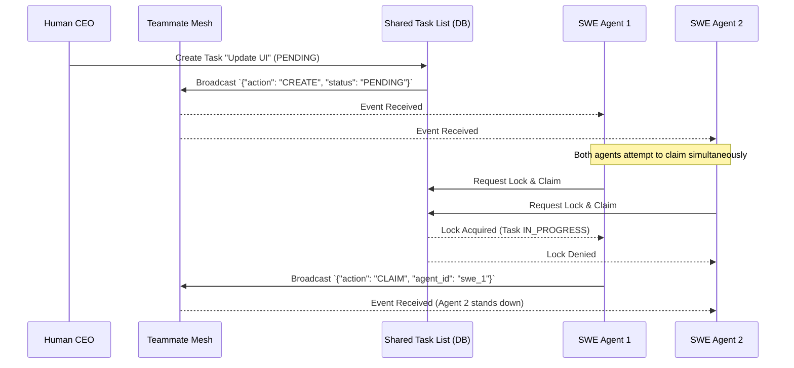

<div markdown="1" style="backdrop-filter: blur(20px) saturate(200%); font-family: 'Outfit', 'Inter', sans-serif; border: 1px solid rgba(255, 255, 255, 0.1); padding: 20px; border-radius: 12px; background: rgba(255, 255, 255, 0.05); color: #fff;">

# 🌐 Teammate Mesh: Visual Walkthrough

The **Teammate Mesh** is the central nervous system of the One Human Corp (OHC) Swarm. It allows agents to communicate in real-time, declare intentions, and coordinate complex distributed tasks without race conditions or collision.

## 1. Introduction to Teammate Mesh

In a truly autonomous Agentic OS, agents must not talk over each other. The Teammate Mesh uses highly-available Pub/Sub mechanisms to guarantee sub-millisecond coordination.

- **Cloud-Native Mode:** Powered by Redis Pub/Sub (`mesh:tasks`, `mesh:coordination`).
- **Standalone Mode:** Falls back to sharded local in-memory channels to maximize throughput.

## 2. Distributed Task Coordination

When the Human CEO submits a request, KAIROS Orchestration creates a `PENDING` task in the Shared Task List.

Here is the exact flow of how agents use the Teammate Mesh to claim and execute these tasks:



## 3. Virtual Meeting Rooms (UltraPlan)

For high-priority missions, agents enter a **Virtual Meeting Room** before writing a single line of code. They deliberate using the `UltraPlan` state machine.

```mermaid
graph LR
    subgraph Virtual Meeting Room
    PM[Product Manager] <-->|mesh:coordination| Dir[Engineering Director]
    Dir <-->|mesh:coordination| Sec[Security Engineer]
    end

    Dir -->|Consensus Reached| DB[(Shared Task List)]

    classDef premium fill:rgba(255,255,255,0.03),stroke:rgba(255,255,255,0.08),stroke-width:1px,color:#fff,backdrop-filter:blur(20px) saturate(200%);
    class PM,Dir,Sec,DB premium;
```

During this deliberation, agents exchange `MeshMessage` payloads containing `agent_id`, `action`, and `status`.

## 4. Subscribing to the Mesh

To view real-time operations, the Human CEO's Dashboard subscribes to the Centrifuge channels provided by the Teammate Mesh API:

```javascript
// Connect to the Teammate Mesh Centrifuge Hub
const sub = centrifuge.newSubscription('mesh:tasks');

sub.on('publication', function(ctx) {
    const data = ctx.data;
    console.log(`Agent ${data.agent_id} performed action: ${data.action} (Status: ${data.status})`);
});

sub.subscribe();
```

*To see how this realtime data is permanently stored, refer to the [AutoDream Sync Engine Walkthrough](autodream_sync.md).*

</div>