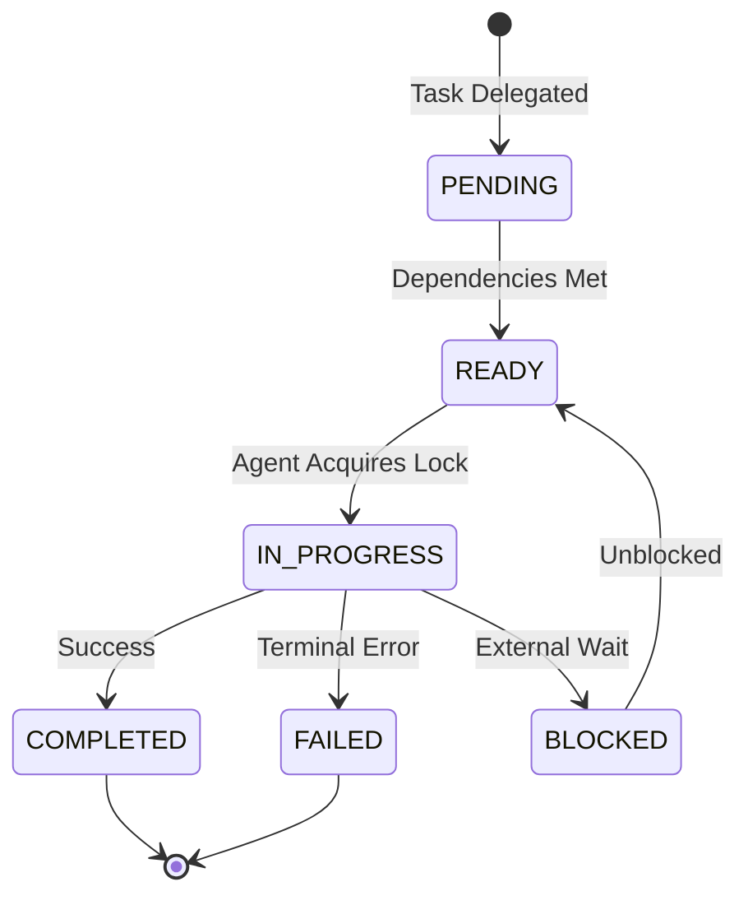
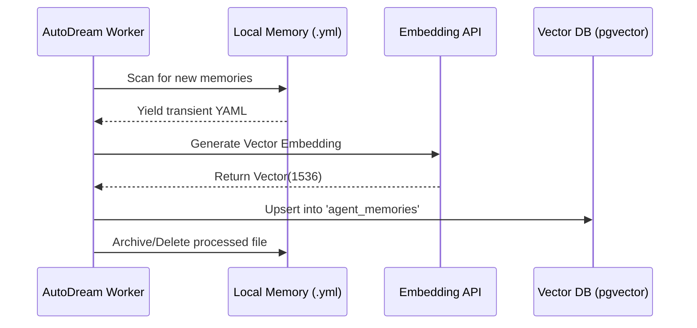

<div markdown="1" style="backdrop-filter: blur(20px) saturate(200%); font-family: 'Outfit', 'Inter', sans-serif; border: 1px solid rgba(255, 255, 255, 0.1); padding: 20px; border-radius: 12px; background: rgba(255, 255, 255, 0.05); color: #fff;">

# OHC Walkthrough: Teammate Mesh & AutoDream Architecture

**Version:** 1.0.0
**Target Audience:** Orchestration Engineers, AI Agents & Human CEOs

## 1. Introduction

The **Teammate Mesh** and **AutoDream Memory Consolidation** form the core of the Swarm Intelligence Protocol (OHC-SIP). They enable real-time collaboration and long-term memory durability across our distinct operating modes: Cloud-Native and Standalone Desktop.

This walkthrough visually explains the orchestration flows and state machines powering OHC's swarm autonomy.

## 2. Teammate Mesh Coordination

The Teammate Mesh is our highly available Pub/Sub mechanism. It allows agents to broadcast intentions, request locks, and synchronize status instantly.

### Hybrid Architecture Routing

```mermaid
graph TD
    subgraph Cloud-Native Mode
        CloudAgent[Agent A] -->|Publish 'mesh:tasks'| Redis[(Redis Pub/Sub)]
        Redis -->|Subscribe| CloudHub[Orchestration Hub]
        CloudHub -->|Centrifuge SSE| ClientUI[Web/Mobile Client]
    end

    subgraph Standalone Desktop Mode
        LocalAgent[Agent A] -->|Local Channel / IPC| LocalHub[Local Orchestration Hub]
        LocalHub -->|Local State| StandaloneUI[Desktop Shell]
    end

    classDef premium fill:rgba(255,255,255,0.03),stroke:rgba(255,255,255,0.08),stroke-width:1px,color:#fff,backdrop-filter:blur(20px) saturate(200%);
    class CloudAgent,Redis,CloudHub,ClientUI,LocalAgent,LocalHub,StandaloneUI premium;
```

### Shared Task Lifecycle

Tasks within the Swarm follow a strict state machine to prevent race conditions during distributed handoffs.



## 3. AutoDream Memory Consolidation

Agents initially generate transient memories. To convert these insights into long-term swarm intelligence, the **AutoDream** pipeline executes periodically.

### The Consolidation Pipeline

1. **Extraction:** A background worker reads temporary YAML files from `.agent-task/memory/`.
2. **Embedding:** The content is sent to the configured LLM embedding API (e.g., Minimax, OpenAI `ada-002`).
3. **Storage:** The resulting vector is upserted into `agent_memories` (backed by PostgreSQL `pgvector` or SQLite local fallback).



## 4. Sub-Agent Interactions

When tasks require specialized skills, agents can spawn sub-agents. The Teammate Mesh handles the lock acquisition dynamically to avoid TOCTOU (Time-of-check to time-of-use) vulnerabilities across distributed Postgres queues or local SQLite instances.

**Key Rule for Centrifuge Events:** Ensure that messages broadcasted to the `mesh:tasks` Centrifuge channel place the `agent_id`, `action`, and `status` keys at the **root** of the JSON payload.

## 5. Next Steps

- Review the [API Playbook](../api/playbook.md) for detailed JSON payloads.
- Explore the [Help Portal](./help_portal.md) for CEO-level team provisioning guides.

</div>
