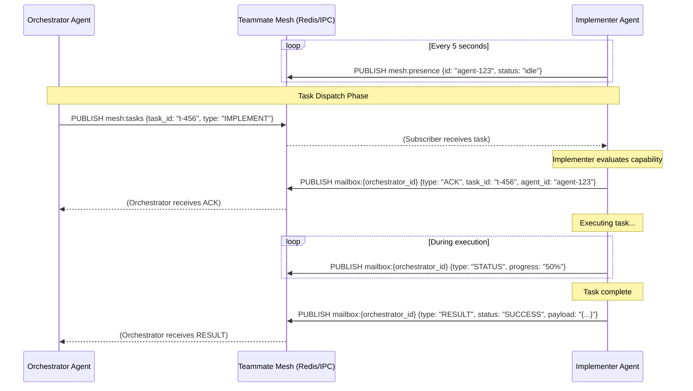

# Teammate Mesh Orchestration Walkthrough

  <strong>Premium Walkthrough</strong> 
  Welcome to the interactive walkthrough for the Teammate Mesh Orchestration system. This guide illustrates how real-time communication flows between agents in the OHC Hybrid Agentic OS, using Redis Pub/Sub for Cloud Mode or local IPC for Standalone Mode.

## Architecture Overview

The Teammate Mesh acts as the neural network for our agentic swarm. It guarantees that whether an agent is running locally on a developer's machine or distributed across a Kubernetes cluster, the communication logic remains identical.

### Core Communication Channels

1.  **`mesh:tasks`**: The global event bus where orchestrators dispatch high-level tasks to available implementers.
2.  **`mesh:presence`**: A heartbeat channel where agents broadcast their availability and status.
3.  **`mailbox:{agent_id}`**: Direct, point-to-point communication channels used for agent-to-agent negotiations, results delivery, and error reporting.

## Sequence Diagram: Agent Communication Flow

Below is a detailed sequence diagram showing the standard flow of a task from an Orchestrator through the Teammate Mesh to an Implementer, and back.

## Protocol Specifications

### The Mailbox Protocol

Direct communication between agents relies on the Mailbox Protocol. When Agent A needs to talk to Agent B, it publishes a message to `mailbox:{agent_b_id}`.

This protocol ensures:
*   **Privacy**: Only the targeted agent processes the message.
*   **Reliability**: In Cloud mode, this is backed by Redis streams or reliable Pub/Sub, ensuring messages are delivered even if the agent momentarily drops connection.

### The Presence Protocol

Agents continuously broadcast their state to `mesh:presence`. This allows the orchestrator to build a real-time topology of the swarm.
Status states include:
*   `STARTING`: Agent is initializing and connecting to the mesh.
*   `IDLE`: Agent is ready for work.
*   `BUSY`: Agent is currently executing a task.
*   `TERMINATING`: Agent is shutting down gracefully.

## Standalone vs Cloud Mode

  <strong>Implementation Detail</strong> 
  The `TeammateMesh` interface completely abstracts the underlying transport layer.
  <ul>
    <li><strong>Cloud Mode</strong>: Uses Redis Pub/Sub for distributed, high-throughput messaging across clusters.</li>
    <li><strong>Standalone Mode</strong>: Uses local SQLite-backed IPC or in-memory channels, enabling identical behavior without external dependencies.</li>
  </ul>

