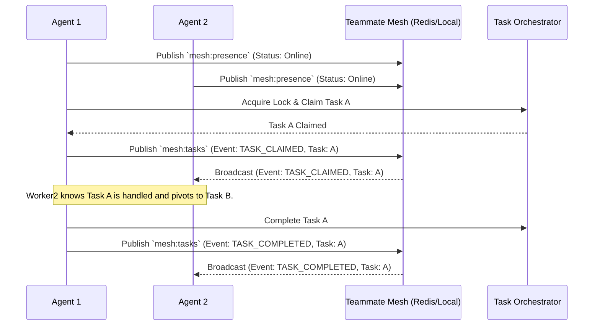

# KAIROS Teammate Mesh Orchestration: Visual Walkthrough

This document visualizes the Teammate Mesh, the real-time communication layer of the OHC Hybrid Agentic OS, enabling "Zero Friction" swarm intelligence.

## The Teammate Mesh Architecture

Agents coordinate autonomously via the mesh using Redis Pub/Sub in Cloud-Native mode or in-memory buses in Standalone mode.

## Hybrid Reliability

In Standalone Mode, the `TeammateMesh` interface degrades gracefully from distributed Redis channels to local inter-process communication, ensuring offline capability without code changes.

