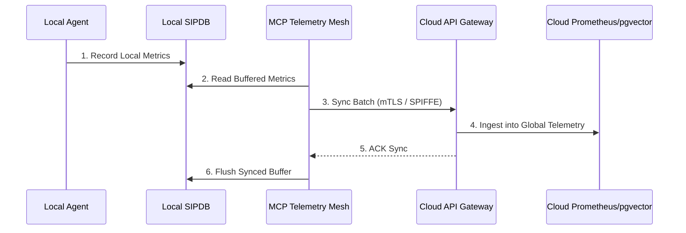

# Hybrid Swarm-Aware MCP Telemetry Mesh Walkthrough

Welcome to the Telemetry Mesh guide. This walkthrough explains how the OHC Hybrid Architecture securely synchronizes observability metrics from local Standalone deployments to the Cloud PostgreSQL/Prometheus stack.

## 1. Observability Sync Lifecycle

Agents running in Standalone Mode log metrics locally to the SQLite SIPDB. The Telemetry Mesh batches and transmits these over a secure SPIFFE/SPIRE authenticated channel when connected.

## 2. Telemetry MCP Operations

The Telemetry MCP provides endpoints for agents to query their own health metrics autonomously, validating multitenant isolation.

For full API specifications, please refer to the [API Playbook](../api/playbook.md).

