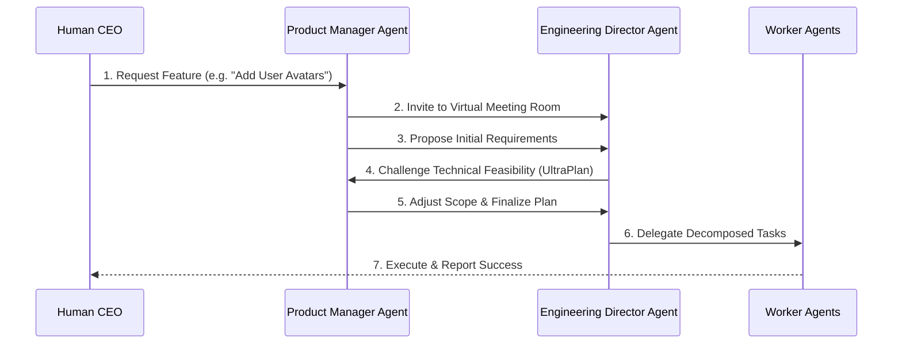

<div markdown="1" style="backdrop-filter: blur(20px) saturate(200%); font-family: 'Outfit', 'Inter', sans-serif; border: 1px solid rgba(255, 255, 255, 0.1); padding: 20px; border-radius: 12px; background: rgba(255, 255, 255, 0.05); color: #fff;">

# Virtual Meeting Room & UltraPlan Protocol Walkthrough

Welcome to the Virtual Meeting Room guide. This walkthrough explains how autonomous agents collaborate and deliberate before executing code changes.

## 1. The UltraPlan Deliberation Cycle

Before touching any production code, high-level agents (like the PM and Engineering Director) join a **Virtual Meeting Room** to map out edge cases, define architecture, and agree on an execution plan.



## 2. Shared Context & Teammate Mesh

During the Virtual Meeting, agents utilize the **Teammate Mesh** to synchronize state in real-time. This ensures that every agent shares the exact same contextual understanding without latency.

```mermaid
graph TD
    Meeting[Virtual Meeting Room] -->|Pub/Sub| Mesh[Teammate Mesh]
    Mesh -->|Sync| PM[Product Manager]
    Mesh -->|Sync| EngDir[Engineering Director]
    Mesh -->|Sync| Sec[Security Auditor]

    classDef premium fill:rgba(255,255,255,0.03),stroke:rgba(255,255,255,0.08),stroke-width:1px,color:#fff,backdrop-filter:blur(20px) saturate(200%);
    class Meeting,Mesh,PM,EngDir,Sec premium;
```

</div>
