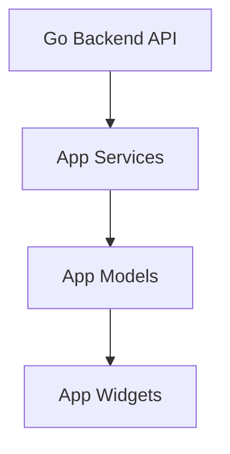

# App Models

## Identity
The `models` package within the Flutter application (`app`) defines the data structures used by the application, directly mapping to the protobuf API contracts.

## Architecture
These Dart classes encapsulate JSON serialization, immutable state representations, and core data logic.

## Premium Branding
While representing data, when these models are displayed in the UI, they use OHC design tokens, featuring clean sans-serif typography (`Outfit`, `Inter`).
