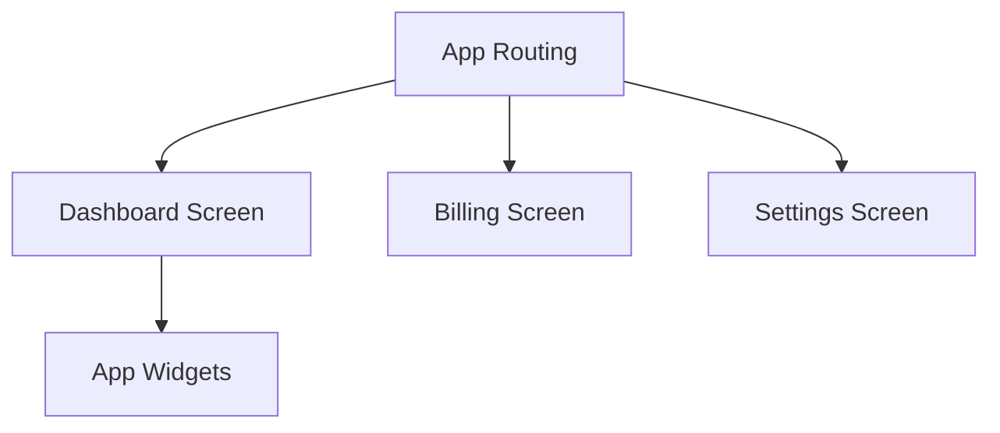

# App Screens

## Identity
The `screens` package within the Flutter application (`app`) contains the top-level route definitions and views for the One Human Corp dashboard.

## Architecture
These screens orchestrate widgets, services, and models to form complete user workflows.

## Premium Feel
All screens strictly adhere to the OHC Premium Branding, specifically utilizing Glassmorphism for depth and visual separation:
- `backdrop-filter: blur(15px) saturate(180%)`
- `background: rgba(255, 255, 255, 0.05)`
- `font-family: 'Outfit', 'Inter', sans-serif`
