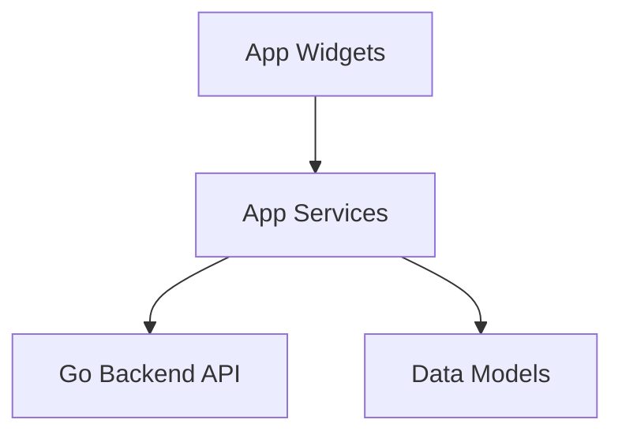

# App Services

## Identity
The `services` package within the Flutter application (`app`) handles state management, business logic, and backend API interactions.

## Architecture
This layer sits between the UI components (Widgets) and the models, encapsulating complex data fetching logic, Riverpod providers, and API requests.

## Visual Excellence
While this is a logic layer, any loading states or errors surfaced to the UI must adhere to the OHC Premium Branding:
- `font-family: 'Outfit', 'Inter', sans-serif`
- Glassmorphism loading overlays.
