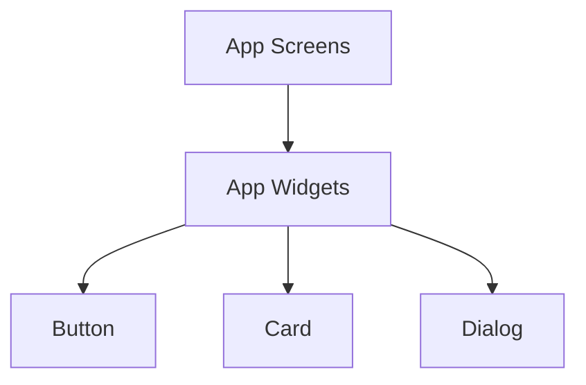

# App Widgets

## Identity
The `widgets` package within the Flutter application (`app`) contains reusable UI components for the One Human Corp dashboard.

## Architecture
These are stateless and stateful components that build up the complex views, implementing the required aesthetic tokens.

## Aesthetic Guidelines (OHC CSS Tokens)
All widgets in this directory strictly adhere to the OHC Premium Branding:
- `backdrop-filter: blur(15px) saturate(180%)`
- `background: rgba(255, 255, 255, 0.05)`
- `border: 1px solid rgba(255, 255, 255, 0.1)`
- `font-family: 'Outfit', 'Inter', sans-serif`
