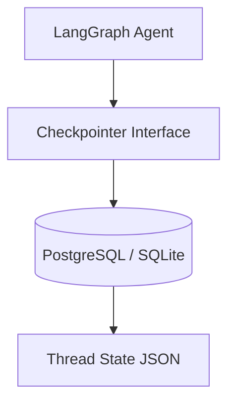

# Checkpointer

## Identity
The `checkpointer` module provides the state persistence layer for LangGraph agents within the One Human Corp platform.

## Architecture
This module implements the `LangGraphCheckpointer` interface, backed by PostgreSQL/SQLite, to store and retrieve agent thread states. This prevents "Agent Amnesia" and allows for robust cross-session context persistence.

## Premium Aesthetic
Any UI visualising thread checkpoints will adhere to the OHC Glassmorphism tokens:
- `backdrop-filter: blur(15px) saturate(180%)`
- `border: 1px solid rgba(255, 255, 255, 0.1)`
