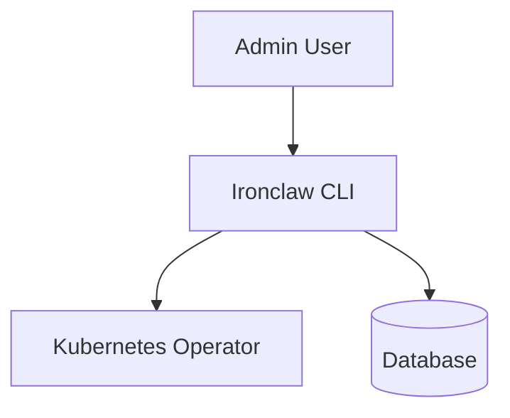

# Ironclaw Command

## Identity
The `ironclaw` binary is a specialized CLI tool for managing specific administrative workflows within the One Human Corp cluster.

## Architecture
This package wraps specific domain logic and MCP commands into an easy-to-use Go executable.

## Aesthetic Guidelines
Even in terminal output, `ironclaw` aims for clean, highly readable formatting, utilizing color-coded ASCII output to mirror the "Outfit/Inter" aesthetic of the web platform.
