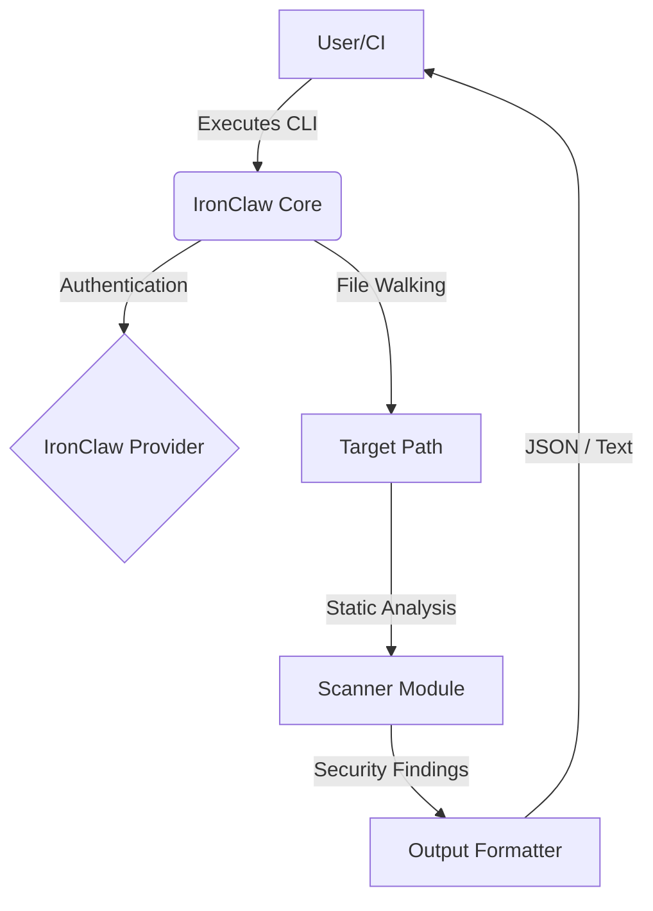

# IronClaw CLI

**IronClaw** is a security and audit-focused agent CLI that integrates with the OneHumanCorp platform. It authenticates against the IronClaw provider, runs static-analysis security scans, and reports findings.

## Architectural Walkthrough

## Developer Insights
*See `docs/shared_context.md` for ongoing security hardening and technical debt notes.*

