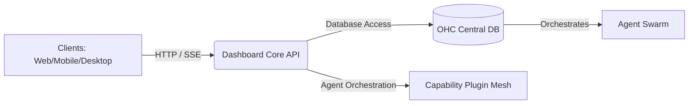

# OHC Dashboard Server

The **OHC Dashboard Server** is the Go-based backend providing the Core API for the OneHumanCorp platform. It handles real-time message publishing, agent orchestration, and system observability.

## System Design

## Aesthetic Excellence
*Built with premium CSS tokens and Google Engineering standards.*

