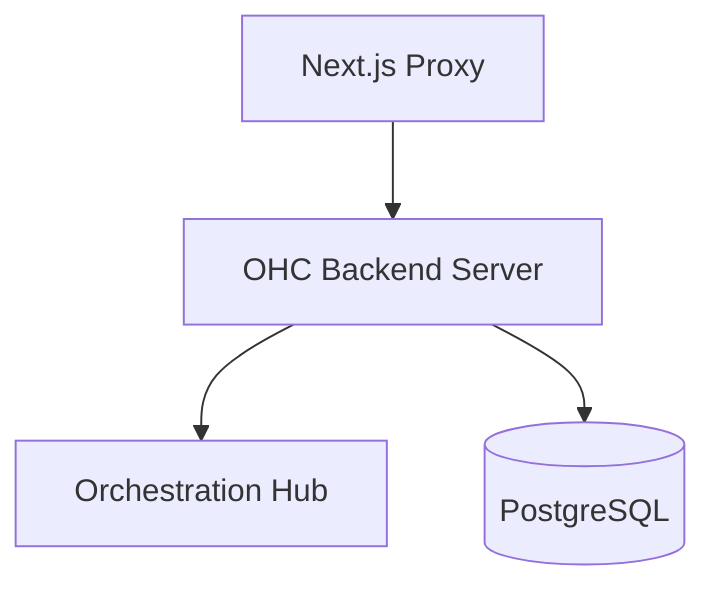

# OHC Command

## Identity
The `ohc` command is the primary backend binary for running the One Human Corp Go dashboard server.

## Architecture
This executable initializes the orchestrator hub, connects to the database, binds the API routes, and serves incoming HTTP requests from the frontend proxy.

## Premium Branding
When the `ohc` command starts up, it logs its status and version information using structured JSON and clean formatting, adhering to the OHC style guide.
