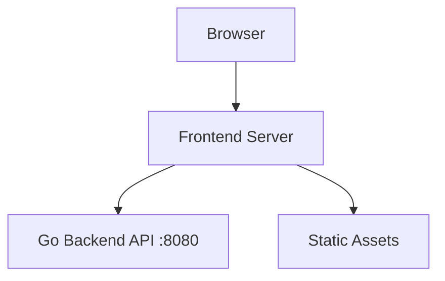

# Frontend Server

## Identity
The `server` package within the `frontend` directory provides the proxy logic for connecting the Next.js/React frontend (or Flutter app) to the Go backend.

## Architecture
This allows developers to map specific API routes to the central Orchestration Hub safely and efficiently.

## Aesthetic Execution
The proxy ensures that Next-Generation OHC CSS tokens are securely delivered to the client without CORS or proxy errors, preserving the glassmorphism UI:
- `backdrop-filter: blur(15px) saturate(180%)`
- `background: rgba(255, 255, 255, 0.05)`
