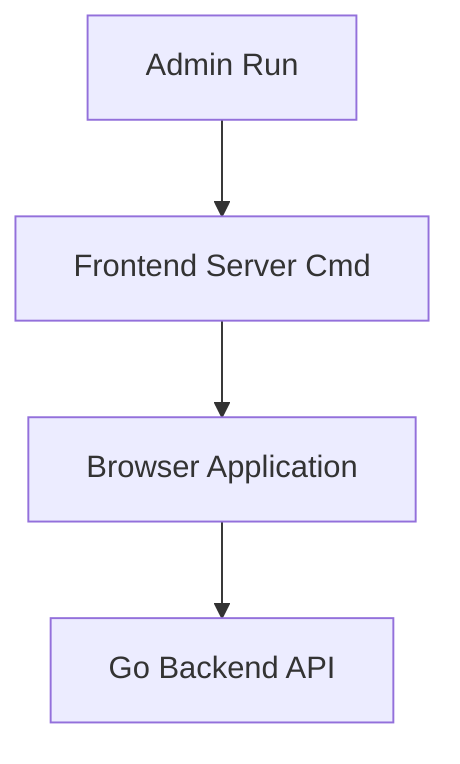

# Frontend Server Command

## Identity
The `frontend` command within `server/cmd` is the executable that launches the Next.js proxy server for the One Human Corp dashboard.

## Architecture
This spins up an HTTP server that serves the static UI assets and routes API calls back to the main Go backend.

## Visual Standard
When launched, this server provides the host for the premium OHC interface, styled with Glassmorphism and Outfit typography.
