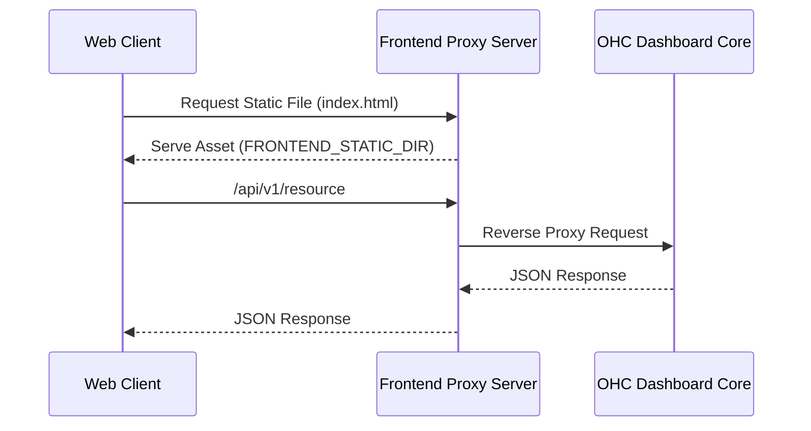

# Frontend Proxy Server

The **Frontend Proxy Server** is responsible for serving the Flutter web static assets and reverse-proxying API traffic to the backend dashboard server. This eliminates CORS issues and simplifies deployment.

## Request Flow

## Developer Usage

*Requires `FRONTEND_STATIC_DIR` and `BACKEND_URL` environment variables.*

