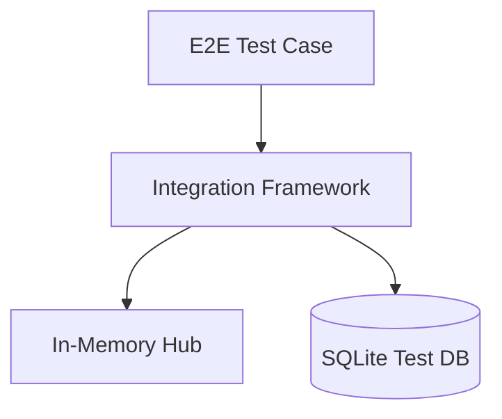

# Integration

## Identity
The `integration` package provides a framework and shared tools for end-to-end integration testing within the One Human Corp backend.

## Architecture
This allows developers to spin up in-memory instances of the database, the orchestration hub, and external APIs for hermetic verification.

## Verification Guidelines
All E2E test runs utilize the `browser` tool (Playwright) or this framework to verify that components integrate properly and adhere strictly to the OHC aesthetic guidelines.
