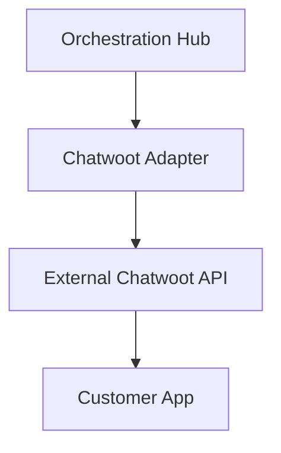

# Chatwoot Integration

## Identity
The `chatwoot` module handles the external integration between One Human Corp agents and the Chatwoot platform.

## Architecture
This allows support agents to interact directly with customer service tickets dynamically.

## Aesthetic Guidelines
All frontend visualisations of external platforms like Chatwoot must utilize the OHC Glassmorphism tokens:
- `backdrop-filter: blur(15px) saturate(180%)`
- `background: rgba(255, 255, 255, 0.05)`
