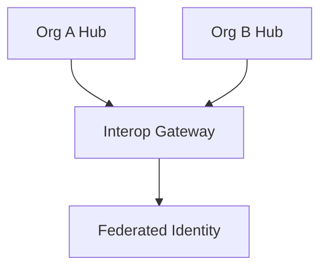

# Interoperability

## Identity
The `interop` module provides cross-organization communication, trust peering, and capability sharing for the One Human Corp B2B ecosystem.

## Architecture
This allows agents from one organization to negotiate securely with another via Federated SPIFFE/SPIRE, breaking down the silo of single-organization AI.

## Premium Feel
UI elements representing inter-org negotiation use the OHC Design System, clearly distinguishing external agents with specialized visual indicators while maintaining the core `blur(15px)` depth tokens.
