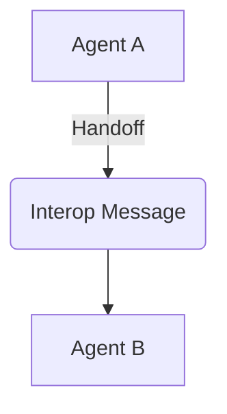

# Interop Component

This package handles inter-agent handoff models, logic, and multi-agent protocol communication logic.



## Styling
```css
.premium-glass {
  backdrop-filter: blur(15px) saturate(180%);
  background: rgba(255, 255, 255, 0.05);
}
```
