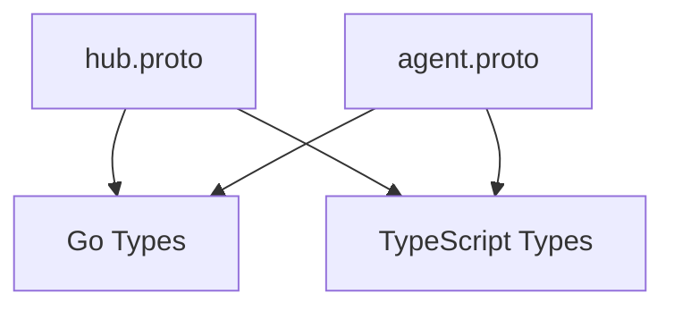

# Protocol Buffers

## Identity
The `proto` package contains the fundamental data contracts defining agent communication and domain entities.

## Architecture
These `.proto` files are the source of truth for both the Go backend and the frontend, generated via Bazel `go_proto_library` and `ts_proto_library` rules.



## Developer Usage
To regenerate protobufs:
```bash
bazelisk build //srcs/proto/...
```
