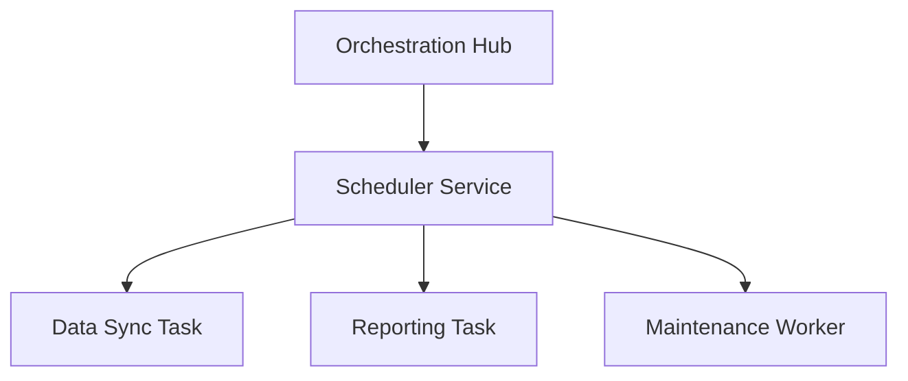

# Scheduler

## Identity
The `scheduler` package manages background tasks, asynchronous workers, and cron jobs for the One Human Corp backend.

## Architecture
This service allows for delayed execution of system maintenance, data synchronization, and reporting functions.

## Premium UI Representation
Task monitoring dashboards use OHC Glassmorphism design system to represent active task queues.
