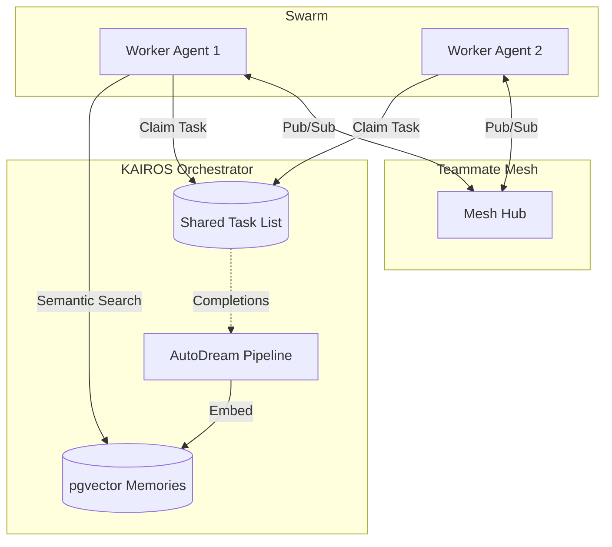

# Phase 4 - KAIROS Orchestration: Unified Architecture

## Overview
The KAIROS Orchestration layer synthesizes the OHC Swarm's distributed state machine, realtime communication, and long-term memory into a cohesive architecture.

## KAIROS Triad
1. **Shared Task List**: Distributed state machine for the agent team, utilizing PostgreSQL's `FOR UPDATE SKIP LOCKED` for high-concurrency claiming and SQLite transactions for standalone local deployments.
2. **Teammate Mesh**: Highly available, low-latency communication layer. In Cloud-Native Mode, this operates over Redis Pub/Sub via CentrifugeNode. In Standalone Mode, it gracefully degrades to local memory channels.
3. **AutoDream**: Continuous background pipeline where Minimax LLMs compress session logs and agent context, embedding them into a durable `pgvector` index for long-term semantic retrieval.

## Architecture Diagram

## Aesthetic Guidelines
Any downstream UI interpreting this architecture MUST apply:
`backdrop-filter: blur(20px) saturate(200%); background: rgba(255, 255, 255, 0.03); font-family: 'Outfit', 'Inter', sans-serif; border-radius: 12px; border: 1px solid rgba(255, 255, 255, 0.1);`
