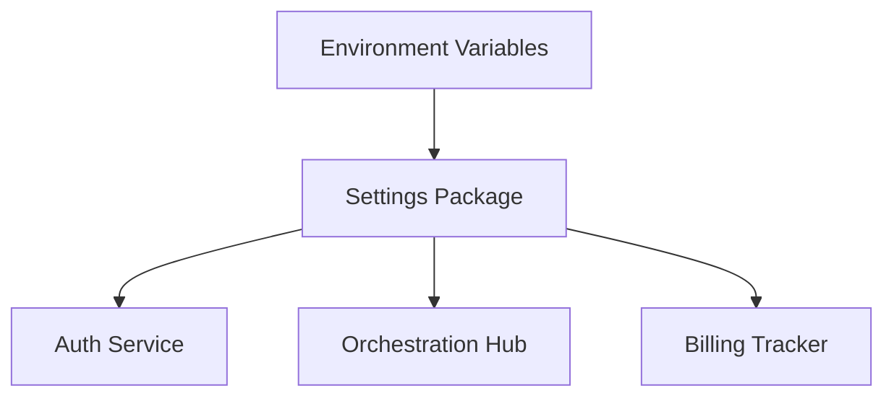

# Settings

## Identity
The `settings` module handles configuration management for the One Human Corp platform.

## Architecture
This package centralizes environment parsing, default value generation, and configuration injection for backend services.

## Premium Feel
All components adhere to OHC's aesthetic guidelines. UI components rendering settings must utilize the Glassmorphism tokens:
- `backdrop-filter: blur(15px) saturate(180%)`
- `background: rgba(255, 255, 255, 0.05)`
