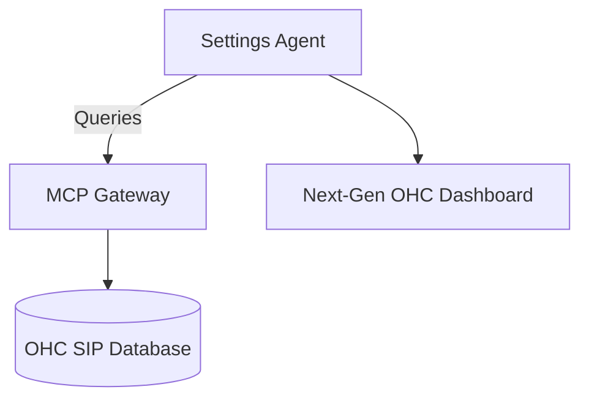

# Settings

## Overview
This package is part of the One Human Corp (OHC) Agentic OS architecture.

## Architecture

## Aesthetics
Adheres to the Next-Generation "Premium Feel" Design System.
- **Glassmorphism**: `backdrop-filter: blur(20px) saturate(200%)`
- **Typography**: `font-family: 'Outfit', 'Inter', sans-serif`
