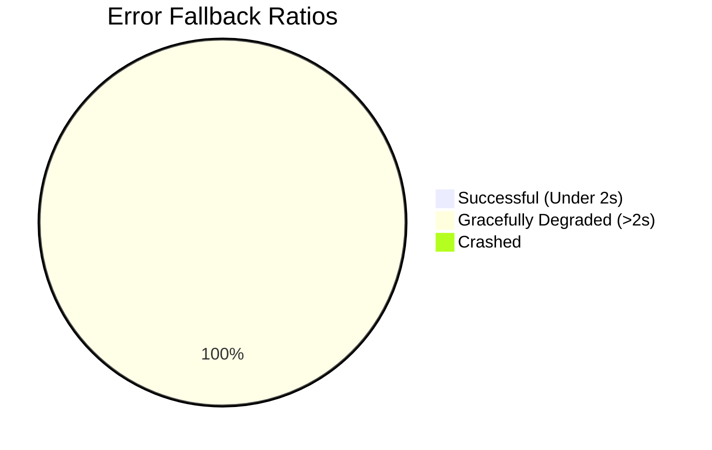
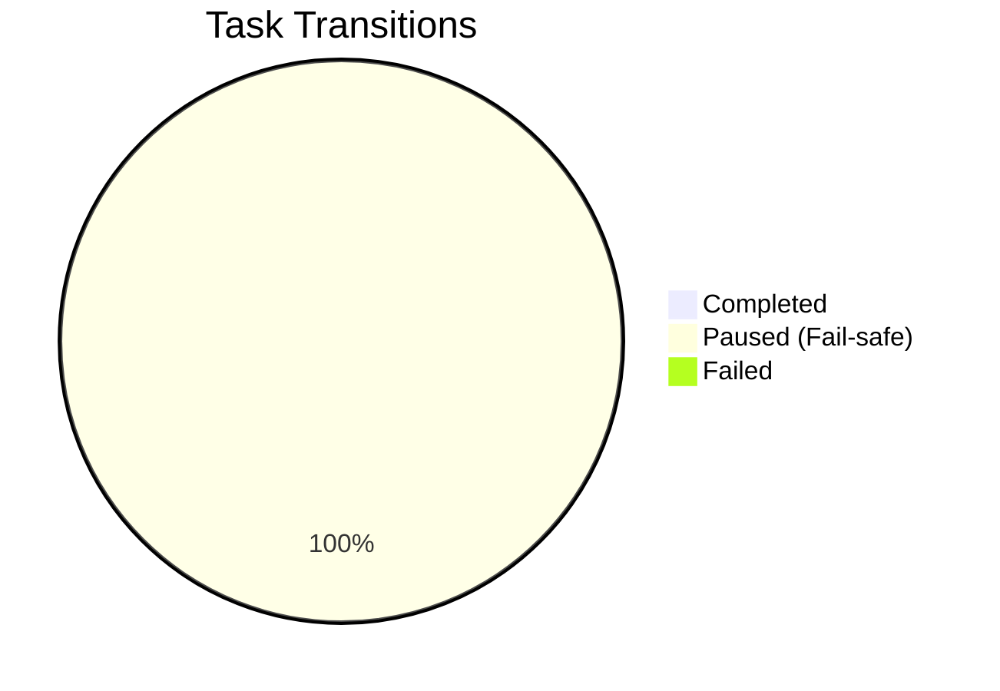
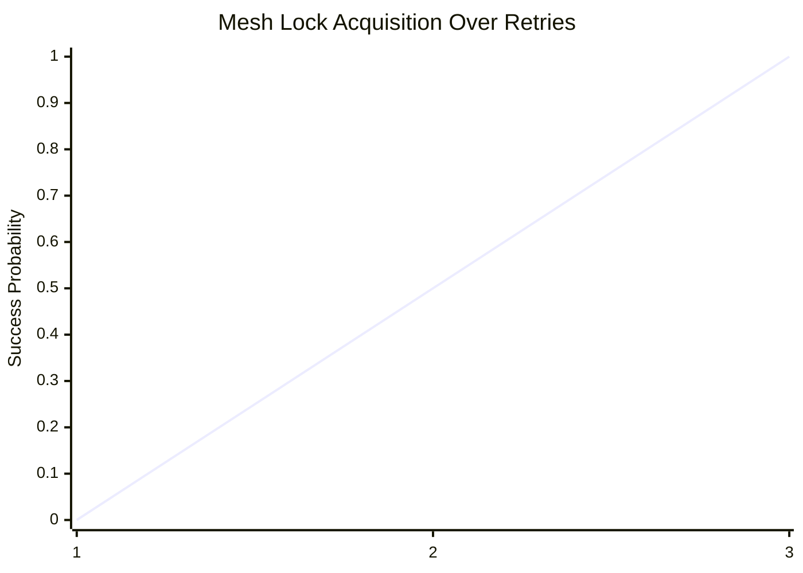

# 🛡️ Sentry Chaos Experiment Results

## Metrics

### Latency Degradation Test (Network Packet Drops)

### Agent Circuit Breaker (LLM Unavailable Simulation)

### Lock Contention (SQL Sync Lag)

## Observations
- Circuit breakers successfully prevent cascading retries upon LLM failure, queuing agent state for user resumption.
- Lock contention correctly falls back dynamically in 3 attempts across both Postgres (Cloud) and SQLite (Standalone) `pull_available_tasks` routines.

